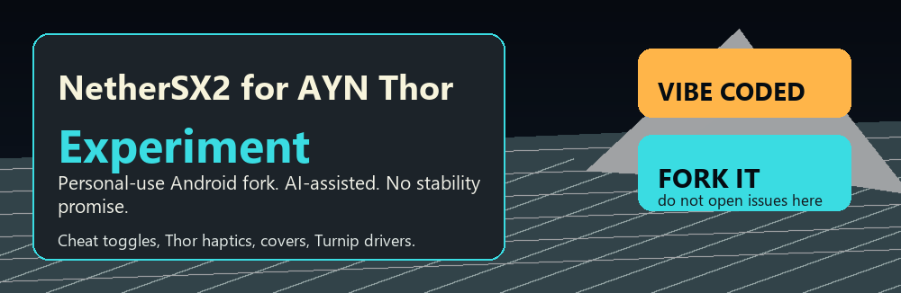
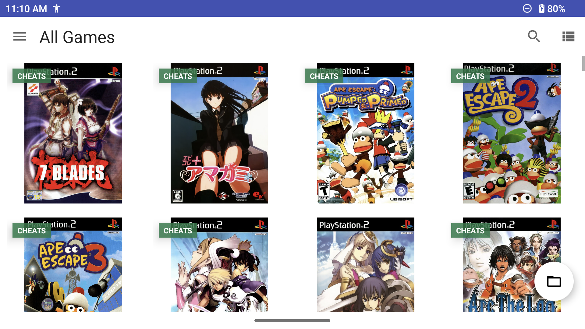
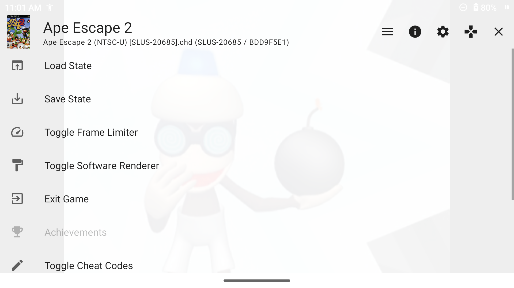
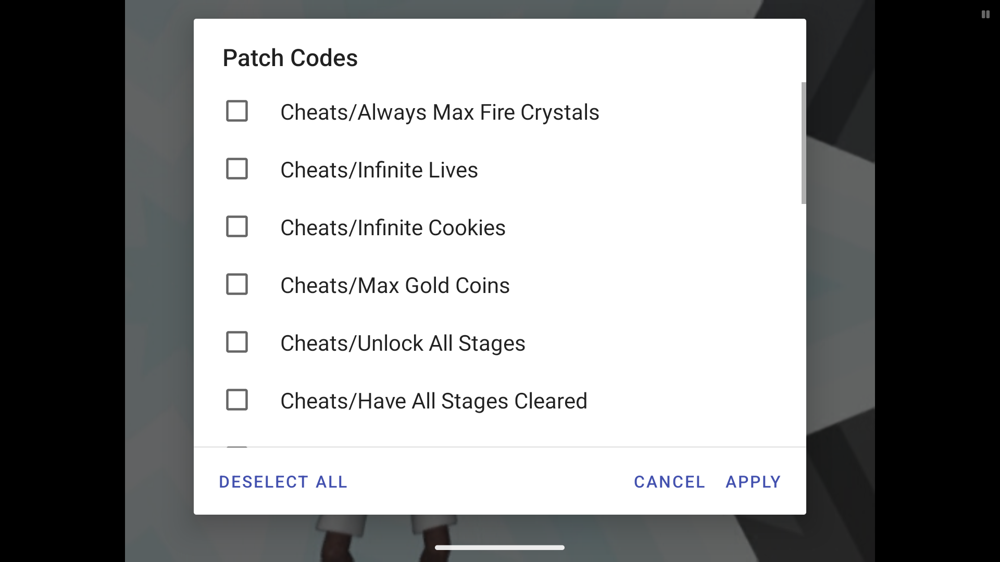

<p align="center">
  
</p>

<p align="center">
  <a href="https://github.com/noeldvictor/NetherSX2-patch-thor-experiment/fork">
    
  </a>
</p>

# NetherSX2 Thor Experiment

This is a personal-use AYN Thor experiment fork built on NetherSX2/AetherSX2 patching work. It is vibe coded with AI assistance, pushed fast, tested on one handheld, and shaped around my own Android emulator workflow.

If AI-assisted/vibe-coded emulator tinkering bothers you, this probably is not your repo. Use upstream, fork this, or build your own thing.

No warranty, no stability promise, no support queue, no guarantee that a build will boot your games, preserve your saves, or keep working after Android/device updates. Back up your data before installing anything from here.

Do not open issues asking for support, compatibility, builds, game fixes, or feature requests. Fork it and do stuff yourself.

## What This Is

- An APK patching workspace, not a normal Gradle Android source tree.
- A personal fork aimed at making NetherSX2 nicer on AYN Thor.
- A place for fast Android usability experiments: cheats, covers, haptics, custom GPU drivers, and handheld-first defaults.
- Not affiliated with PCSX2, AetherSX2, NetherSX2, AYN, or Sony.

## Where This Diverges

- Rebranded as `NetherSX2 Thor Experiment` with new launcher icon, banner, wordmarks, and setup strings.
- Adds game-list `CHEATS` badges only when the visible external `.pnach` file has real `patch=` cheat lines.
- Adds an in-game OSD `Toggle Cheat Codes` shortcut above `Patch Codes`.
- Lets you toggle individual PNACH cheat blocks with checkboxes, plus `Deselect All`.
- Normalizes gameplay cheats toward `patch=1` every-frame behavior instead of startup-only `patch=0`.
- Bundles tracked exact-CRC PNACH cheats into the APK and seeds missing external cheat files without overwriting user toggle state.
- Includes curated exact cheats, including the verified `Wizardry - Tale of the Forsaken Land` no-enemy-encounter patch.
- Adds cover install tooling that defaults to xlenore PS2 covers and supports custom URL templates.
- Adds AYN Thor haptic fallback through Android media/game vibration paths.
- Adds a custom GPU driver manager using `libadrenotools`, a Vulkan shim, a known-good Turnip download, custom URLs, and a live Turnip driver browser.
- Adds ADB helper scripts for pushing cheats/covers and fixing Android file permissions on Thor.

## Thor Performance Notes

The current target device is an AYN Thor reporting Qualcomm `kalama` / `QCS8550` / Adreno Vulkan. The useful optimization work is mostly handheld-specific presets and per-game overrides, not random core hacks.

Good default direction for Thor:

- Use Vulkan with the custom Turnip driver browser when a game likes it.
- Use `Performance Cores` affinity so hot EE/GS/VU threads stay on the big/prime cluster.
- Keep Fastmem and Instant VU1 enabled.
- Enable MTVU for most 3D games, but keep it per-game because a few games can regress.
- Use 1.5x or 2x internal resolution as the practical baseline, then lower heavy games before touching unsafe EE cycle skip.
- Try `Disable Readbacks (Synchronize GS Thread)` for speed, but fall back to Accurate if a game has broken effects, videos, or missing UI.
- Avoid global 60 FPS or widescreen patches as a performance default; they are per-game compatibility choices.

Thor itself still needs its device performance mode/fan set outside the app. If Android reports Thor `performance_mode=0`, the emulator can be perfectly tuned and still leave speed on the table.

## Screenshots

<p align="center">
  
</p>

<p align="center">
  
</p>

<p align="center">
  
</p>

## Thor Helpers

Install tracked cheat packs to an attached Android device:

```powershell
powershell -NoProfile -ExecutionPolicy Bypass -File tools\InstallCheatsToDevice.ps1
```

Refresh only the imported community cheats without overwriting curated exact-file toggle state:

```powershell
powershell -NoProfile -ExecutionPolicy Bypass -File tools\InstallCheatsToDevice.ps1 -CommunityOnly
```

Install covers for games listed in `game_crc_index.tsv` using xlenore's default 2D cover URL:

```powershell
powershell -NoProfile -ExecutionPolicy Bypass -File tools\InstallCoversToDevice.ps1
```

Use another cover source by overriding `-BaseUrl`. The template supports `{serial}`, `{crc}`, `{title}`, and `{ext}`:

```powershell
powershell -NoProfile -ExecutionPolicy Bypass -File tools\InstallCoversToDevice.ps1 -BaseUrl 'https://raw.githubusercontent.com/xlenore/ps2-covers/main/covers/3d/{serial}.png'
```

Check the active custom GPU driver breadcrumb after installing one through the app:

```powershell
adb shell cat /sdcard/Android/data/xyz.aethersx2.android/files/gpu_driver_current.txt
```

## Build Notes

This repo patches a decoded APK. The main patch flow is:

```powershell
cd decomp
.\Hackify.bat
```

Then rebuild, zipalign, sign, and install the APK. See `AGENTS.md` for the living notes on the current patch scripts and Thor-specific ADB workflow.

## Credits

- PCSX2: <https://github.com/PCSX2/pcsx2>
- AetherSX2 and NetherSX2 patching community work
- EZOnTheEyes: <https://www.youtube.com/@EZOnTheEyes>
- Saramagrean: <https://github.com/Saramagrean/NetherSX2-cheats>
- xs1l3n7x PCSX2 cheat collection: <https://github.com/xs1l3n7x/pcsx2_cheats_collection>
- xlenore PS2 covers: <https://github.com/xlenore/ps2-covers>
- SDL_GameControllerDB: <https://github.com/mdqinc/SDL_GameControllerDB>
